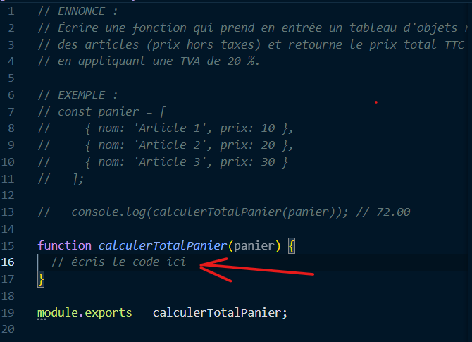

<!-- # Algo JS par HazeFury

Ce repo contient des exercices d'algorithmie pour 3 niveaux différents (basique /intermédiaire / avancé)

## Comment l'installer ? 

- cloner ce repo 
- placer-vous dans le dossier du projet
- installer les dépendances avec la commande : `npm install`
- vous êtes prêt à coder :) 

## Comment l'utiliser ? 

Commencez par ouvrir le fichier d'un algo dans votre IDE préféré puis, après avoir lu la consigne, modifier le contenu de la fonction



Pour lancer les tests de tous les algos (sur tout les fichiers) : `npm run tests` 

Pour lancer le les test sur un seul fichier : `npm run test:one {NomDuFichierTest}` 
exemple : `npm run test:one B1.test.js`

 -->
# Projet d'Algorithmie en JavaScript

Bienvenue dans ce projet d'algorithmie en JavaScript, conçu pour les débutants et les développeurs souhaitant renforcer leurs compétences en logique et en programmation. Ce projet propose des exercices progressifs, classés par niveau de difficulté, avec des tests automatisés pour valider vos solutions.

---

## 🧩 **Objectifs du Projet**

- Développer des compétences en résolution de problèmes algorithmiques.
- Manipuler les concepts fondamentaux de JavaScript (tableaux, chaînes de caractères, objets, etc.).
- Découvrir les bonnes pratiques de développement : tests automatisés, linters, formateurs.
- Préparer aux situations réelles en proposant des problèmes inspirés de cas pratiques.

---

## 🏗️ **Structure du Projet**

Chaque algorithme est organisé en trois fichiers principaux :

1. **Fichier avec l'énoncé et une fonction à compléter** (ex. `B1.js`) :
   - Contient la description du problème.
   - Propose une fonction vide que vous devez implémenter.
   
2. **Fichier de tests automatisés avec Jest** (ex. `B1.test.js`) :
   - Conçu pour valider votre solution.
   - Teste les cas standards, limites et spécifiques.

3. **Fichier de correction** (ex. `B1.correction.js`) :
   - Fournit une solution complète et commentée.
   - Peut inclure des approches alternatives pour enrichir votre apprentissage.

---

## 🚦 **Niveaux de Difficulté**

Les exercices sont divisés en trois niveaux pour assurer une progression pédagogique :

- **Basique (B)** : Concepts fondamentaux.
- **Intermédiaire (I)** : Problèmes impliquant plusieurs étapes ou concepts combinés.
- **Avancé (A)** : Problèmes complexes nécessitant une réflexion approfondie et une optimisation.

---

## ⚙️ **Prérequis**

- **Node.js** installé sur votre machine.
- Une base en JavaScript (variables, fonctions, boucles, tableaux, etc.).

---

## 📦 **Installation**

 Clonez le repository sur votre machine :

   ```BASH
   git clone git@github.com:HazeFury/algo-js.git

   cd algo-js

   npm install
   ```


Vous êtes prêt à commencer ✅

---

## 🚀 **Utilisation**

Lancer tous les tests :
```bash
npm run tests
```

Lancer les tests pour un exercice spécifique :
```bash
# npm run test:one {NomDuFichierTest}

npm run test:one B1.test.js
```

Linter et formater le projet avec Biome :
```bash
npx biome check .
npx biome format .
```
---

## ✏️ **Exemple d'Exercice**

```JS
// ENNONCE :
// Écrire une fonction qui prend en entrée un tableau d'objets représentant
// des articles (prix hors taxes) et retourne le prix total TTC du panier,
// en appliquant une TVA de 20 %.

// EXEMPLE :
// const panier = [
//     { nom: 'Article 1', prix: 10 },
//     { nom: 'Article 2', prix: 20 },
//     { nom: 'Article 3', prix: 30 }
//   ];

// RESULTAT ATTENDU :
// console.log(calculerTotalPanier(panier));
//
// ==> 72.00

function calculerTotalPanier(panier) {
	// écris le code ici
	return panier;
}

module.exports = calculerTotalPanier;

```
---

## 📚 **Ressources Supplémentaires**

-  [Documentation officielle Jest](https://jestjs.io/)

- [Documentation officielle Biome](https://biomejs.dev/)

- [MDN JavaScript](https://developer.mozilla.org/fr/docs/Web/JavaScript)

--- 
## 📜 **Licence**

Ce projet est sous licence MIT. Vous êtes libre de l'utiliser, de le modifier et de le partager.

---

## Projet développé avec passion par **[HazeFury](https://github.com/HazeFury)** 😎
### Bon code  ! 🎉